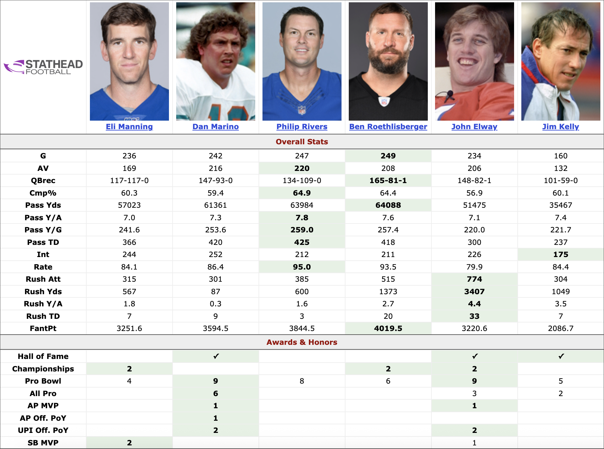

# Introduction
The general consensus around the NFL today is that the 1983 draft had the greatest quarterback class of all time. John Elway, Dan Marino, and Jim Kelly combined for 23 Pro Bowls, 11 All Pros, 2 MVPs, 10 Super Bowl Appearances, and 2 Super Bowl Championships. Each made the Hall of Fame. 

The consensus runner-up is the 2004 draft class, featuring Eli Manning, Ben Roethlisberger, and Philip Rivers. Given their recent retirements (or coming out of retirement), only Eli Manning is eligible for induction. He has been on the past two ballots but hasn't been inducted. Roethlisberger will be eligible in 2027 while Rivers reset his 5 year waiting period by coming out of retirement last season.



Each player has an interesting case. Phillip Rivers has had no playoff success while Eli Manning won 2 Super Bowl MVPs. Ben Roethlisberger's resume is a mesh of the two. He doesn't quite have Rivers' raw statistics and accolades nor Manning's playoff impact. 

Will the 2004 draft class also have three Hall of Fame inductees? What achievement matters the most? I created a machine learning mdoel to answer those questions. 

# The Model

```{python}
# Import necessary libraries and data
import pandas as pd
import numpy as np
from lets_plot import *
LetsPlot.setup_html()
import sklearn
from sklearn.model_selection import train_test_split
from sklearn.tree import DecisionTreeClassifier 
from sklearn.ensemble import RandomForestClassifier
from sklearn.metrics import classification_report
from sklearn.preprocessing import MinMaxScaler
from xgboost import XGBClassifier
from imblearn.over_sampling import SMOTE

general = pd.read_csv("https://raw.githubusercontent.com/ethanabbott10/Sports_Data/refs/heads/main/data/qbgeneral.csv")

super_bowls = pd.read_csv("https://raw.githubusercontent.com/ethanabbott10/Sports_Data/refs/heads/main/data/qbsuperbowls.csv")

hof = pd.read_csv("https://raw.githubusercontent.com/ethanabbott10/Sports_Data/refs/heads/main/data/qbhof.csv")

pro_bowls = pd.read_csv("https://raw.githubusercontent.com/ethanabbott10/Sports_Data/refs/heads/main/data/qbprobowls.csv")

all_pros = pd.read_csv("https://raw.githubusercontent.com/ethanabbott10/Sports_Data/refs/heads/main/data/qballpros.csv")
```

```{python}
# 1). Preprocessing data

# Drop rank and player columns from data frames
unwanted_columns = ['Rk', 'Player']
super_bowls = super_bowls.drop(columns = unwanted_columns)
hof = hof.drop(columns = unwanted_columns)
pro_bowls = pro_bowls.drop(columns = unwanted_columns)
all_pros = all_pros.drop(columns = unwanted_columns)

# Get Super Bowl count
super_bowl_count = super_bowls['player_id'].value_counts().reset_index()
super_bowl_count.columns = ['player_id', 'super_bowls']

# Fill hof column with positive
hof['hof'] = 1

# Merge data frames into one
data_frames = [all_pros, super_bowl_count, hof]
df = pd.merge(
    left = general,
    right = pro_bowls,
    how = "left",
    on = "player_id")

for data_frame in data_frames:
    df = pd.merge(
    left = df,
    right = data_frame,
    how = "left",
    on = "player_id")

#Fill N/As
int_columns = ['hof', 'super_bowls', 'Sk', 'Yds.1', 'W', 'L', 'T', '1D']
float_columns = ['Cmp%', 'TD%', 'Int%', 'Rate', 'Sk%', 'Y/A', 'AY/A', 'ANY/A', 'Y/C', 'Succ%', 'Y/A.1', 'Succ%.1']

for column in int_columns:
    df[column] = df[column].fillna(0).astype(int)

for column in float_columns:
    df[column] = df[column].fillna(0)

# Create Hall of Fame Eligible Column
df['eligible'] = np.where(df['To'] >= 2020, 0, 1)

# Create 16 games column
df['16_games'] = round(df['G'] / 16, 2)

# Create W% column
df['W%'] = round(df['W'] / (df['W'] + df['L'] + df['T']), 2).fillna(0)


# Create per season columns 
df['passing_yards_per_16_games'] = round(df['Yds'] / df['16_games'], 2)
df['passing_attempts_per_16_games'] = round(df['Att'] / df['16_games'], 2)
df['passing_tds_per_16_games'] = round(df['TD'] / df['16_games'], 2)
df['int_per_16_games'] = round(df['Int'] / df['16_games'], 2)
df['pick_6_per_16_games'] = round(df['Yds'] / df['16_games'], 2)
df['sacks_per_16_games'] = round(df['Sk'] / df['16_games'], 2)
df['sacks_yards_per_16_games'] = round(df['Yds.1'] / df['16_games'], 2)
df['wins_per_16_games'] = round(df['W'] / df['16_games'], 2)
df['losses_per_16_games'] = round(df['L'] / df['16_games'], 2)
df['ties_per_16_games'] = round(df['T'] / df['16_games'], 2)
df['fourth_quarter_comebacks_per_16_games'] = round(df['4QC'] / df['16_games'], 2)
df['game_winning_drives_per_16_games'] = round(df['GWD'] / df['16_games'], 2)
df['rushing_yards_per_16_games'] = round(df['Yds.2'] / df['16_games'], 2)
df['rushing_tds_per_16_games'] = round(df['TD.1'] / df['16_games'], 2)
df['rushing_first_downs_per_16_games'] = round(df['Sk'] / df['16_games'], 2)
df['pro_bowls_per_16_games'] = round(df['Pro_Bowls'] / df['16_games'], 2)
df['first_team_all_pros_per_16_games'] = round(df['AP1'] / df['16_games'], 2)
df['super_bowls_per_16_games'] = round(df['super_bowls'] / df['16_games'], 2)

# Drop more unwanted columns
df = df.drop(columns = ['Rk', 'Age', 'player_id'])

# Rename columns
df.columns = ['player', 'career_start', 'career_end', 'games', 'games_started', 'completions', 'passing_attempts', 'incompletions', 'completion_%', 'passing_yards', 'passing_tds', 'interceptions', 'pick_6s', 'touchdown_%', 'int_%', 'passer_rating', 'sacks_taken', 'sack_yards', 'sack_%', 'passing_yards_per_attempt', 'adjusted_passing_yards_per_attempt', 'adjusted_net_passing_yards_per_attempt', 'passing_yards_per_completion', 'passing_yards_per_game', 'pass_success_rate', 'wins', 'losses', 'ties', 'fourth_quarter_comebacks', 'game_winning_drives', 'rushing_attempts', 'rushing_yards', 'rushing_yards_per_attempt', 'rushing_touchdowns', 'rushing_yards_per_game', 'rushing_first_downs', 'rush_success_rate', 'pro_bowls', 'first_team_all_pros', 'super_bowls', 'hall_of_fame', 'hall_of_fame_eligible', '16_games', 'winning_%', 'passing_yards_per_16_games', 'passing_attempts_per_16_games', 'passing_tds_per_16_games', 'int_per_16_games', 'pick_6_per_16_games', 'sacks_per_16_games', 'sacks_yards_per_16_games', 'wins_per_16_games', 'losses_per_16_games', 'ties_per_16_games', 'fourth_quarter_comebacks_per_16_games', 'game_winning_drives_per_16_games', 'rushing_yards_per_16_games', 'rushing_tds_per_16_games', 'rushing_first_downs_per_16_games', 'pro_bowls_per_16_games', 'first_team_all_pros_per_16_games', 'super_bowls_per_16_games']

# Scale values using MinMaxScaler
scaler = MinMaxScaler()
numeric_columns = ['games', 'games_started', 'completions', 'passing_attempts', 'incompletions', 'completion_%', 'passing_yards', 'passing_tds', 'interceptions', 'pick_6s', 'touchdown_%', 'int_%', 'passer_rating', 'sacks_taken', 'sack_yards', 'sack_%', 'passing_yards_per_attempt', 'adjusted_passing_yards_per_attempt', 'adjusted_net_passing_yards_per_attempt', 'passing_yards_per_completion', 'passing_yards_per_game', 'pass_success_rate', 'wins', 'losses', 'ties', 'fourth_quarter_comebacks', 'game_winning_drives', 'rushing_attempts', 'rushing_yards', 'rushing_yards_per_attempt', 'rushing_touchdowns', 'rushing_yards_per_game', 'rushing_first_downs', 'rush_success_rate', 'pro_bowls', 'first_team_all_pros', 'super_bowls', 'hall_of_fame', 'hall_of_fame_eligible', '16_games', 'winning_%', 'passing_yards_per_16_games', 'passing_attempts_per_16_games', 'passing_tds_per_16_games', 'int_per_16_games', 'pick_6_per_16_games', 'sacks_per_16_games', 'sacks_yards_per_16_games', 'wins_per_16_games', 'losses_per_16_games', 'ties_per_16_games', 'fourth_quarter_comebacks_per_16_games', 'game_winning_drives_per_16_games', 'rushing_yards_per_16_games', 'rushing_tds_per_16_games', 'rushing_first_downs_per_16_games', 'pro_bowls_per_16_games', 'first_team_all_pros_per_16_games', 'super_bowls_per_16_games']

for column in numeric_columns:
    df[column] = scaler.fit_transform(df[[column]])

# Split into eligible and ineligible data frames
eligible = df[df['hall_of_fame_eligible'] == 1]
ineligible = df[df['hall_of_fame_eligible'] == 0]
```

I trained an XGBoost classification model using statistics from [Pro Football Reference] (https://www.pro-football-reference.com/) for 80% of the quarterbacks eligible for the Hall of Fame whose stats they have. (Click the dropdown to see which stats were used)

<details>
<summary><strong>Stats Used</strong></summary>

- Games Played
- Games Started
- Completions
- Passing Attempts 
- Incompletions
- Completion %
- Passing Yards
- Passing Touchdowns
- Interceptions
- Pick 6's
- Touchdown %
- Interception %
- Passer Rating
- Sacks Taken
- Sack Yards
- Sack %
- Passing Yards per Attempt
- Adjusted Passing Yards per Attempt
- Adjusted Net Passing Yards per Attempt, 'passing_yards_per_completion', 'passing_yards_per_game', 'pass_success_rate', 'wins', - Games Played
- Games Started
- Completions
- Passing Attempts
- Incompletions
- Completion %
- Passing Yards
- Passing Touchdowns
- Interceptions
- Pick 6's
- Touchdown %
- Interception %
- Passer Rating
- Sacks Taken
- Sack Yards
- Sack %
- Passing Yards per Attempt
- Adjusted Passing Yards per Attempt
- Adjusted Net Passing Yards per Attempt
- Passing Yards per Completion
- Passing Yards per Game
- Pass Success Rate
- Wins
- Losses
- Ties
- Fourth Quarter Comebacks
- Game Winning Drives
- Rushing Attempts
- Rushing Yards
- Rushing Yards per Attempt
- Rushing Touchdowns
- Rushing Yards per Game
- Rushing First Downs
- Rush Success Rate
- Pro Bowls
- First Team All-Pros
- Super Bowls
- Hall of Fame
- Hall of Fame Eligible
- 16 Games
- Winning %
- Per 16 games metrics for each stat that isn't a percentage or a rating

</details>

The other 20% were used to test the model. 

```{python}
# 2). Selection, training, and use of a machine learning model

# Create X and y from eligible data set
X = eligible.drop(columns = ['hall_of_fame', 'player', 'hall_of_fame_eligible'])
y = eligible['hall_of_fame']

# Split into test and training data
X_train, X_test, y_train, y_test = train_test_split(X, y, test_size = 20)

# SMOTE to help with inbalanced data
sm = SMOTE()
X_sm, y_sm = sm.fit_resample(X_train, y_train)
```

```{python}
# XGBoost
xg = XGBClassifier(scale_pos_weight = 27.37)
xg.fit(X_train, y_train)
xg_prediction = xg.predict(X_test)
xg_report = classification_report(y_test, xg_prediction)
print("Model Confusion Matrix")
print(xg_report)

# Use XGBoost model to make predictions on ineligible players

Z = ineligible.drop(columns = ['player', 'hall_of_fame_eligible', 'hall_of_fame'])

hof_predictions = xg.predict(Z)

players = pd.DataFrame({
    'player': ineligible['player'].values,
    'hof': hof_predictions
})

wrong_predict = xg.predict(X)

wrong = pd.DataFrame({
    'player' : eligible['player'].values,
    'real' : eligible['hall_of_fame'].values,
    'predicted' : wrong_predict
}).query('real != predicted')

players.head(10)
```


